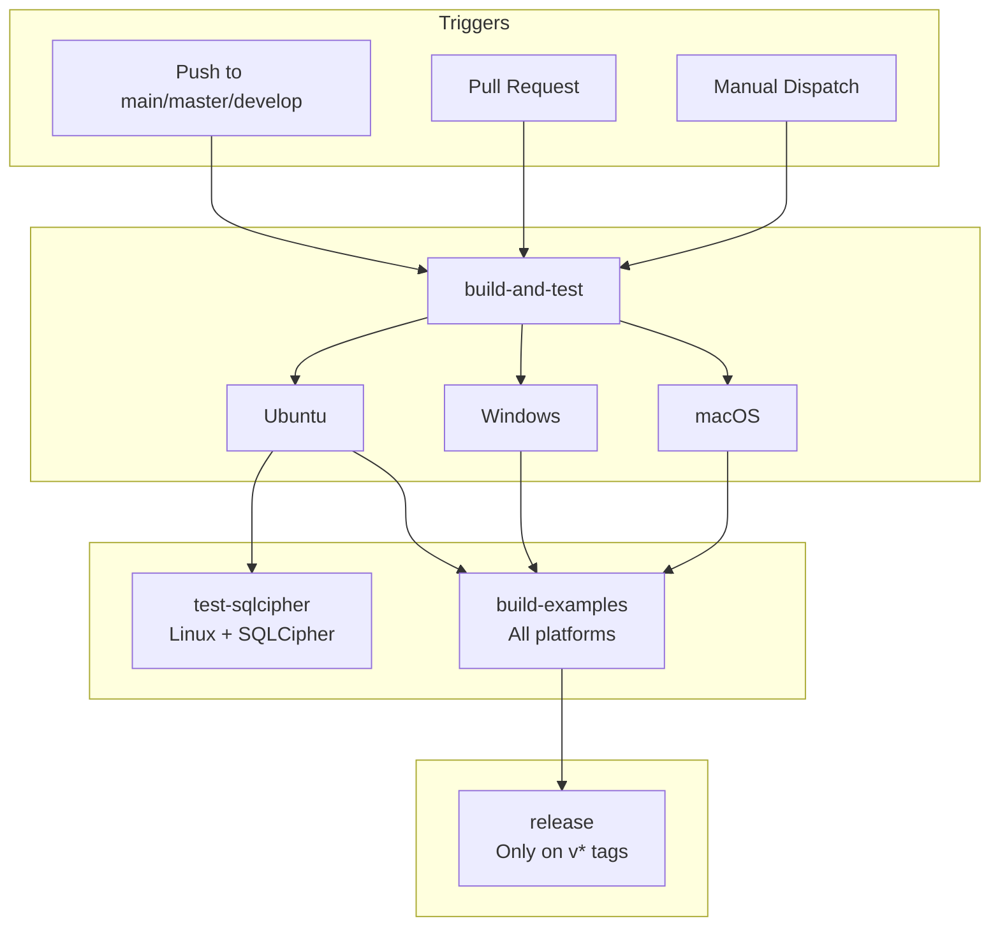

# NDXSQLite CI/CD Pipeline

This directory contains GitHub Actions workflow definitions for automated building, testing, and releasing of NDXSQLite.

## Workflow Overview

### ci.yml

The main continuous integration workflow that runs on every push and pull request.



```
┌─────────────────────────────────────────────────────────────┐
│                        TRIGGERS                             │
│  • Push to main, master, develop                            │
│  • Pull requests to main, master, develop                   │
│  • Manual workflow dispatch                                 │
└─────────────────────────┬───────────────────────────────────┘
                          │
                          ▼
┌─────────────────────────────────────────────────────────────┐
│                    build-and-test                           │
│                                                             │
│  Runs in PARALLEL on:                                       │
│  ┌─────────────┐ ┌─────────────┐ ┌─────────────┐            │
│  │   Ubuntu    │ │   Windows   │ │    macOS    │            │
│  └─────────────┘ └─────────────┘ └─────────────┘            │
│                                                             │
│  • Install platform dependencies                            │
│  • Setup Lazarus compiler                                   │
│  • Build all test suites                                    │
│  • Execute tests (SQLCipher in basic mode)                  │
└─────────────────────────┬───────────────────────────────────┘
                          │
          ┌───────────────│ 
          │               │               
          ▼               ▼               
┌─────────────────┐ ┌─────────────────┐ 
│  test-sqlcipher │ │  build-examples │ 
│                 │ │                 │ 
│  Linux only     │ │  All platforms  │ 
│  + SQLCipher    │ │  in parallel    │ 
│                 │ │                 │ 
│  Full encryption│ │  Compile all    │ 
│  test suite     │ │  console demos  │ 
└─────────────────┘ └────────┬────────┘
                             │          
                             │                       
                             ▼                       
                    ┌─────────────────────┐               
                    │      release        │               
                    │                     │               
                    │  Only on v* tags    │              
                    │  Creates GitHub     │               
                    │  release            │              
                    └─────────────────────┘               
```

### Pipeline Stages

**Stage 1: build-and-test**
- Runs in parallel on Ubuntu, Windows, and macOS
- Installs platform dependencies
- Sets up Lazarus compiler
- Builds and executes all test suites
- SQLCipher tests run in basic mode (skipped if not installed)

**Stage 2: test-sqlcipher + build-examples**
- `test-sqlcipher`: Linux only, installs SQLCipher, runs full encryption tests
- `build-examples`: All platforms, compiles all console examples

**Stage 3: release**
- Only triggered on version tags (v*)
- Creates GitHub release with auto-generated notes

## Jobs Description

| Job | Runs On | Dependencies | Purpose |
|-----|---------|--------------|---------|
| `build-and-test` | Ubuntu, Windows, macOS | None | Core build and test validation |
| `test-sqlcipher` | Ubuntu | `build-and-test` | SQLCipher encryption tests |
| `build-examples` | Ubuntu, Windows, macOS | `build-and-test` | Verify examples compile |
| `release` | Ubuntu | `build-and-test`, `build-examples` | Create GitHub release (tags only) |

## Test Suites

| Test Suite | Description |
|------------|-------------|
| `NDXSQLiteTests` | Core functionality tests |
| `NDXSQLiteAdvancedTests` | Advanced features (hooks, backup, etc.) |
| `DateTimeUtilsTests` | Date/time utility tests |
| `DateTimeUtilsFunctionalTests` | Date/time functional tests |
| `SQLCipherTests` | Encryption tests (full suite with SQLCipher) |

## Platform Dependencies

### Linux (Ubuntu)

```bash
# Runtime
libsqlite3-0          # SQLite runtime
libgtk2.0-0           # GTK2 runtime

# Development
libsqlite3-dev        # SQLite headers
libgtk2.0-dev         # GTK2 headers

# Encryption tests only
libsqlcipher1         # SQLCipher runtime
libsqlcipher-dev      # SQLCipher headers
```

### Windows

- SQLite DLL downloaded from sqlite.org
- Placed in test directory for runtime access

### macOS

- SQLite included with system
- No additional dependencies required

## Environment Variables

| Variable | Value | Description |
|----------|-------|-------------|
| `LAZARUS_VERSION` | `stable` | Lazarus/FPC version to install |
| `SQLITE_VERSION` | `3450100` | SQLite version for Windows DLL |

## Triggering Workflows

### Automatic Triggers

- **Push**: Any push to `main`, `master`, or `develop` branches
- **Pull Request**: Any PR targeting `main`, `master`, or `develop`

### Manual Trigger

1. Navigate to **Actions** tab in GitHub
2. Select **CI** workflow
3. Click **Run workflow**
4. Select branch and confirm

### Release Trigger

Releases are created automatically when pushing version tags:

```bash
git tag v1.0.0
git push origin v1.0.0
```

## Artifacts

On test failure, the following artifacts are uploaded:

| Artifact | Contents | Retention |
|----------|----------|-----------|
| `test-logs-{platform}` | `*.db`, `*.log` files | 7 days |

## Local Testing

Run the same tests locally:

```bash
# Build tests
cd tests
lazbuild NDXSQLiteTests.lpi
lazbuild NDXSQLiteAdvancedTests.lpi
lazbuild SQLCipherTests.lpi

# Run tests
./NDXSQLiteTests
./NDXSQLiteAdvancedTests
./SQLCipherTests
```

For SQLCipher encryption tests:

```bash
# Install SQLCipher
sudo apt install libsqlcipher1 libsqlcipher-dev

# Run tests (SQLCipher auto-detected)
./SQLCipherTests
```

## Troubleshooting

### Build Failures

| Issue | Solution |
|-------|----------|
| Missing dependencies | Check platform-specific installation commands |
| Lazarus version mismatch | Ensure `LAZARUS_VERSION` is compatible |
| Package not found | Verify `lazbuild --add-package-link` succeeded |

### Test Failures

| Issue | Solution |
|-------|----------|
| SQLite not found | Check library paths in `ndxsqliteplatform.pas` |
| Permission errors | Ensure temp directory is writable |
| Platform-specific | Check platform detection in test setup |

### SQLCipher Tests Skipped

- Verify `libsqlcipher1` is installed
- Check that SQLCipher loads before SQLite (library search order)

## Contributing

When modifying the CI pipeline:

1. Test changes on a feature branch first
2. Use `workflow_dispatch` for manual testing
3. Ensure all platforms pass before merging
4. Update this README if adding new jobs or dependencies

## See Also

- [BUILDING.md](../../BUILDING.md) - Local build instructions
- [GitHub Actions Documentation](https://docs.github.com/en/actions)
- [setup-lazarus Action](https://github.com/gcarreno/setup-lazarus)
